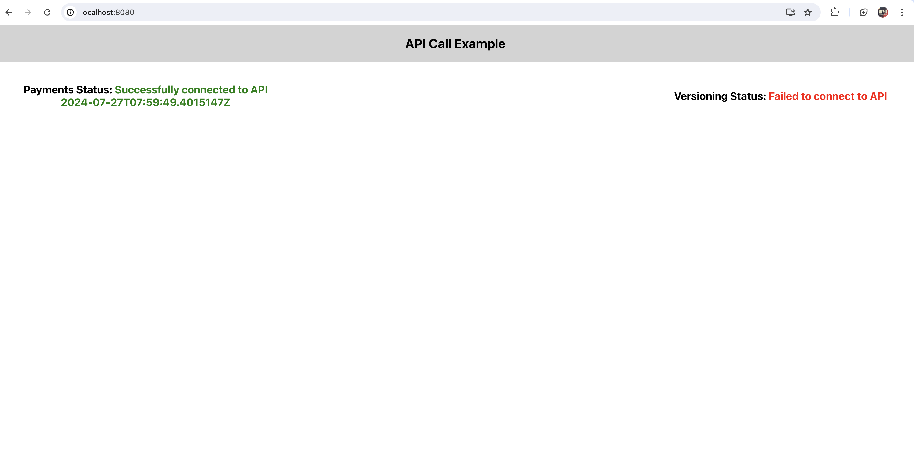

# Sample React App Project With Backend Payments Api


This README provides a step-by-step guide for containerizing a React frontend and a .NET backend, creating Helm charts for Kubernetes deployment, and deploying them in minikube environment and access the front-end application using port-forward.

---

## Table of Contents
1. [Prerequisites](#prerequisites)
2. [Dockerization](#dockerization)
   - [React Frontend](#react-frontend)
   - [Backend (.NET)](#backend-net)
3. [Helm Chart Creation](#helm-chart-creation)
4. [Deployment](#deployment)
5. [Post-Deployment](#post-deployment)
6. [Troubleshooting](#troubleshooting)

---

## Prerequisites

- Docker installed on your machine.
- Minikube cluster set up.
- Helm installed.

## Dockerization

### React Frontend

1. **Dockerfile for React Frontend**

    [Dockerfile](front-end/Dockerfile) created for frontend React app:

   ```Dockerfile
    FROM node:14

    WORKDIR /app
    
    COPY package*.json ./
    
    RUN npm install
    
    COPY . .
    
    EXPOSE 80
    
    CMD ["npm", "start"]
   ```

2. **Build Docker Image**

   ```bash
   cd front-end
   ```
   
   ```bash
   docker build -t front-end:v1.0.0 .
   ```

4. **Push Docker Image to Registry**

   Tag and push the image to your Docker registry (e.g., Docker Hub, Azure Container Registry).

   ```bash
   docker tag front-end:v1.0.0 <your-registry>/front-end:v1.0.0
   docker push <your-registry>/front-end:v1.0.0
   ```

### Backend (.NET)

1. **Dockerfile for .NET Backend**

   [Dockerfile](payments-api/Dockerfile) created for Backend PaymentApi App:

   ```Dockerfile
    # Stage 1: Build the application
    FROM mcr.microsoft.com/dotnet/sdk:7.0 AS build
    
    WORKDIR /app
    
    COPY *.csproj ./
    RUN dotnet restore
    
    COPY . .
    
    RUN dotnet publish -c Release -o out
    
    # Stage 2: Run the application
    FROM mcr.microsoft.com/dotnet/aspnet:7.0 AS runtime
    
    WORKDIR /app
    
    COPY --from=build /app/out ./
    
    EXPOSE 80
    
    ENTRYPOINT ["dotnet", "payments-api.dll"]

   ```

2. **Build Docker Image**

   ```bash
   docker build -t payments-api:v1.0.0 .
   ```

3. **Push Docker Image to Registry**

   ```bash
   docker tag payments-api:v1.0.0 <your-registry>/payments-api:v1.0.0
   docker push <your-registry>/payments-api:v1.0.0
   ```

## Helm Chart Creation

### React Frontend


  [HelmChart](front-end/front-end-chart) created for frontend React app:


### values.yaml

replace ``<your-registry>`` with docker registry

```yaml
image:
  repository: <your-registry>/front-end
  pullPolicy: IfNotPresent
  tag: "v1.0.0"
```

### Backend Payments-Api

  [HelmChart](payments-api/payments-api-chart) created for frontend React app:

### values.yaml

replace ``<your-registry>`` with docker registry

```yaml
image:
  repository: <your-registry>/payments-api
  pullPolicy: IfNotPresent
  tag: "v1.0.0"
```

## Deployment

### React Frontend

1. **Install Helm Chart**

   Navigate to the directory containing your Helm chart and run:

   ```bash
   helm install front-end front-end-chart -n front-end
   ```

2. **Verify Deployment**

   Check the status of the deployments and services:

   ```bash
   kubectl get deployments -n front-end
   kubectl get services -n front-end
   ```

### Backend Payments-Api

1. **Install Helm Chart**

   Navigate to the directory containing your Helm chart and run:

   ```bash
   helm install payments-api payments-api-chart -n payments-api
   ```

2. **Verify Deployment**

   Check the status of the deployments and services:

   ```bash
   kubectl get deployments -n payments-api
   kubectl get services -n payments-api
   ```

## Post-Deployment

- **Access the Applications**: port-forward the front-end and payments-api service to access the frontend and backend applications.
   ```bash
   kubectl port-forward svc/payments-api 8080:80 -n payments-api
   kubectl port-forward svc/front-end 5039:5039 -n front-end
   ```

   access front-end app in the browser using [http://localhost:8080](http://localhost:8080)
  
   
  
- **Scaling**: You can scale your applications by updating the `replicas` field in the `values.yaml` file and running `helm upgrade`.

## Troubleshooting

- **Logs**: Check the logs of the pods using `kubectl logs`.
